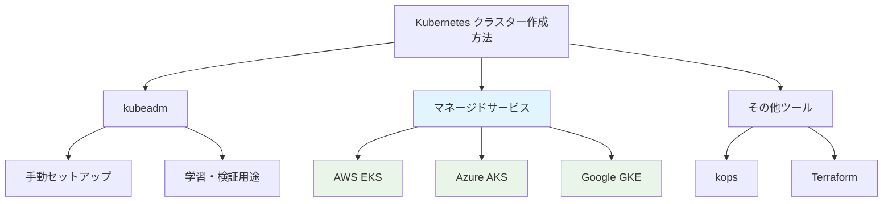

# CKA試験対策: kubeadm完全ガイド

## 目次
1. [kubeadmの位置づけ](#kubeadmの位置づけ)
2. [試験での出題パターン](#試験での出題パターン)
3. [必須コマンド一覧](#必須コマンド一覧)
4. [実践演習](#実践演習)
5. [トラブルシューティング](#トラブルシューティング)
6. [学習優先度](#学習優先度)

---

## kubeadmの位置づけ

### CKA試験における重要度
- **配点比重**: 25%（クラスターアーキテクチャ・インストール・設定）の一部
- **実際の出題割合**: 2-3問程度（全17問中）
- **学習時間配分**: 全体の20%程度が適切

### 現代的な視点


**実務での使用場面**:
- オンプレミス環境でのクラスター構築
- 学習・検証環境の構築
- 既存クラスターのアップグレード作業

---

## 試験での出題パターン

### パターン1: クラスター初期化
```bash
# 典型的な問題
"master ノードで kubeadm を使用してクラスターを初期化し、
pod ネットワーク CIDR を 10.244.0.0/16 に設定せよ"

# 解答例
sudo kubeadm init --pod-network-cidr=10.244.0.0/16
```

### パターン2: ワーカーノード参加
```bash
# 典型的な問題  
"worker ノードをクラスターに参加させよ"

# 解答手順
# 1. master ノードでトークン確認
kubeadm token list
kubeadm token create --print-join-command

# 2. worker ノードで実行
sudo kubeadm join <master-ip>:6443 --token <token> --discovery-token-ca-cert-hash sha256:<hash>
```

### パターン3: クラスターアップグレード
```bash
# 典型的な問題
"kubeadm を使用してクラスターを v1.28.0 にアップグレードせよ"

# 解答手順（master ノード）
sudo kubeadm upgrade plan
sudo kubeadm upgrade apply v1.28.0

# 解答手順（worker ノード）
sudo kubeadm upgrade node
```

### パターン4: CNI インストール
```bash
# 典型的な問題
"Calico CNI をインストールして、Network Policy をサポートするよう設定せよ"

# 解答例
kubectl apply -f https://docs.projectcalico.org/manifests/calico.yaml
```

---

## 必須コマンド一覧

### 1. クラスター初期化関連

```bash
# 基本的な初期化
kubeadm init

# Pod ネットワーク CIDR 指定
kubeadm init --pod-network-cidr=10.244.0.0/16

# API サーバーアドレス指定
kubeadm init --apiserver-advertise-address=192.168.1.10

# 設定ファイルを使用した初期化
kubeadm init --config=kubeadm-config.yaml

# 初期化状態確認
kubeadm config print init-defaults
```

### 2. トークン管理

```bash
# トークン一覧表示
kubeadm token list

# 新しいトークン作成
kubeadm token create

# join コマンド生成
kubeadm token create --print-join-command

# トークン削除
kubeadm token delete <token>
```

### 3. ノード参加

```bash
# ワーカーノード参加
kubeadm join <master-ip>:6443 --token <token> --discovery-token-ca-cert-hash sha256:<hash>

# 証明書ハッシュ確認
openssl x509 -pubkey -in /etc/kubernetes/pki/ca.crt | openssl rsa -pubin -outform der 2>/dev/null | \
openssl dgst -sha256 -hex | sed 's/^.* //'
```

### 4. アップグレード

```bash
# アップグレード計画確認
kubeadm upgrade plan

# アップグレード実行（master）
kubeadm upgrade apply v1.28.0

# アップグレード実行（worker）
kubeadm upgrade node

# kubeadm バージョン確認
kubeadm version
```

### 5. 設定管理

```bash
# kubeconfig ファイル生成
kubeadm kubeconfig user --client-name=<username>

# 証明書情報確認
kubeadm certs check-expiration

# 証明書更新
kubeadm certs renew all
```

---

## 実践演習

### 演習1: シングルノードクラスター構築

```bash
# ステップ1: kubeadm でクラスター初期化
sudo kubeadm init --pod-network-cidr=10.244.0.0/16

# ステップ2: kubectl 設定
mkdir -p $HOME/.kube
sudo cp -i /etc/kubernetes/admin.conf $HOME/.kube/config
sudo chown $(id -u):$(id -g) $HOME/.kube/config

# ステップ3: CNI インストール（Flannel の例）
kubectl apply -f https://raw.githubusercontent.com/flannel-io/flannel/master/Documentation/kube-flannel.yml

# ステップ4: master ノードの taint 除去（シングルノードの場合）
kubectl taint nodes --all node-role.kubernetes.io/control-plane-

# ステップ5: 動作確認
kubectl get nodes
kubectl get pods -A
```

### 演習2: マルチノードクラスター構築

```bash
# Master ノードでの作業
sudo kubeadm init --apiserver-advertise-address=<master-ip> --pod-network-cidr=10.244.0.0/16

# join コマンド保存
kubeadm token create --print-join-command > join-command.txt

# Worker ノードでの作業
# join-command.txt の内容を実行
sudo kubeadm join <master-ip>:6443 --token <token> --discovery-token-ca-cert-hash sha256:<hash>

# Master ノードで確認
kubectl get nodes
```

### 演習3: クラスターアップグレード手順

```bash
# 現在のバージョン確認
kubectl get nodes
kubeadm version

# Master ノードアップグレード
sudo kubeadm upgrade plan
sudo kubeadm upgrade apply v1.28.0

# kubelet と kubectl アップグレード
sudo apt-mark unhold kubelet kubectl && \
sudo apt-get update && sudo apt-get install -y kubelet=1.28.0-00 kubectl=1.28.0-00 && \
sudo apt-mark hold kubelet kubectl

# kubelet 再起動
sudo systemctl daemon-reload
sudo systemctl restart kubelet

# Worker ノードアップグレード（各ノードで実行）
sudo kubeadm upgrade node
# kubelet アップグレード（上記と同様）
```

---

## トラブルシューティング

### よくある問題と解決法

#### 1. kubeadm init が失敗する

```bash
# 問題: swap が有効になっている
# 解決法:
sudo swapoff -a
sudo sed -i '/ swap / s/^\(.*\)$/#\1/g' /etc/fstab

# 問題: ポートが使用中
# 確認:
sudo netstat -tulpn | grep :6443

# 解決法:
sudo kubeadm reset
```

#### 2. ノードが NotReady 状態

```bash
# CNI が未インストールの可能性
kubectl get pods -n kube-system

# CNI インストール
kubectl apply -f <CNI-manifest-URL>
```

#### 3. join が失敗する

```bash
# トークンの有効期限切れ
kubeadm token list

# 新しいトークンで再試行
kubeadm token create --print-join-command
```

#### 4. 証明書エラー

```bash
# 証明書期限確認
kubeadm certs check-expiration

# 証明書更新
sudo kubeadm certs renew all
sudo systemctl restart kubelet
```

### ログ確認方法

```bash
# kubeadm のログ
journalctl -xeu kubelet

# システムログ
sudo tail -f /var/log/syslog | grep kubelet

# Pod ログ
kubectl logs -n kube-system <pod-name>
```

---

## 学習優先度

### 高優先度（必ず覚える